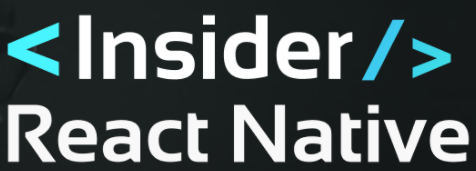

   

  
  
  
  

  <a href="#sobre">Sobre</a>&nbsp;&nbsp;&nbsp;|&nbsp;&nbsp;&nbsp;
  <a href="#tecnologias-utilizadas">Tecnologias utilizadas</a>&nbsp;&nbsp;&nbsp;|&nbsp;&nbsp;&nbsp;
  <a href="#licença-e-autor">Licença e Autor</a>

## Sobre

**React Native Insiders 4.0** trata-se de um projeto realizado durante um evento do Sujeito Programador - React Native Insiders 4.0 🚀🔥

## Projeto

React Prime - Em breve mais informações...

## Rodar projeto

Em breve mais informações...

:)
:)s

### Tecnologias utilizadas

- React Native
- Expo
- Axios
- React Native Navigate
- React Native Stars
- React Native Web View
- React Router Dom
- Async Storage
- Assets {Icon/Splash}

## Licença e Autor

Este projeto está sob a licença MIT. Veja o arquivo [LICENSE](https://github.com/yurimarim/ReactNativeInsiders4.0/blob/main/LICENSE.txt) para mais detalhes.

